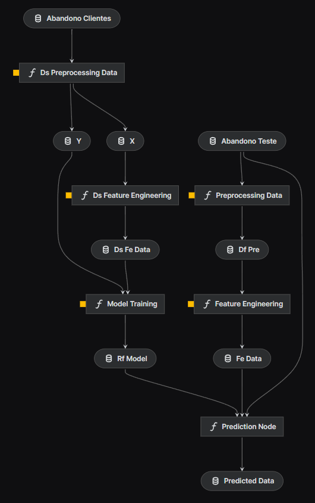

# Previsão de Churn

## Objetivo

O objetivo desse projeto é prever o churn em um banco de dados de uma instituição financeira. Para isso são considerados dois datasets: 

- 1. **database_train:** composto por 10000 linhas e 13 colunas de informação, sendo uma coluna "Exited" composta por dados binários: 1 se o cliente abandonou o banco, 0 se não.
- 2. **database_test:** composto 1000 linhas e 12 colunas e não possui a coluna "Exited".

O objetivo é construir um pipeline de Machine Learning que permita prever essa coluna a partir dos dados de database_test.

## Organização do projeto:

- No diretório 'notebooks' guardei a parte experimental do desenvolvimento, onde estão a análise exploratória e backtests com diferentes algoritmos.
- No diretório 'scr' estão os pipelines:
    - **ds_pipeline** - com o pipeline de treino e teste do modelo;
        - Recebe o arquivo 'database_train.csv', faz o pré-processamento, feature engineering e treino e teste do modelo. O modelo é armazenado para posterior inferência.
    - **inference** - com o pipeline de inferência sobre a base de teste para avaliação do Case.
        - recebe o arquivo CSV com os dados que serão preditos, carrega o modelo treinado no pipeline 'ds_pipeline' e realiza a predição.
- Tendo utilizado o Kedro, é garantida a boa organização do código, sua reprodutibilidade e capacidade de predição.

O resultado final do modelo em arquivo com as colunas 'rowNumber' e 'predictedValues' é gerado no fluxo do pipeline ou manualmente pelos notebooks. E está armazenado na pasta 'data/08_reporting'.

## Diagrama

Os pipelines implementados estão representados nesse diagrama:

